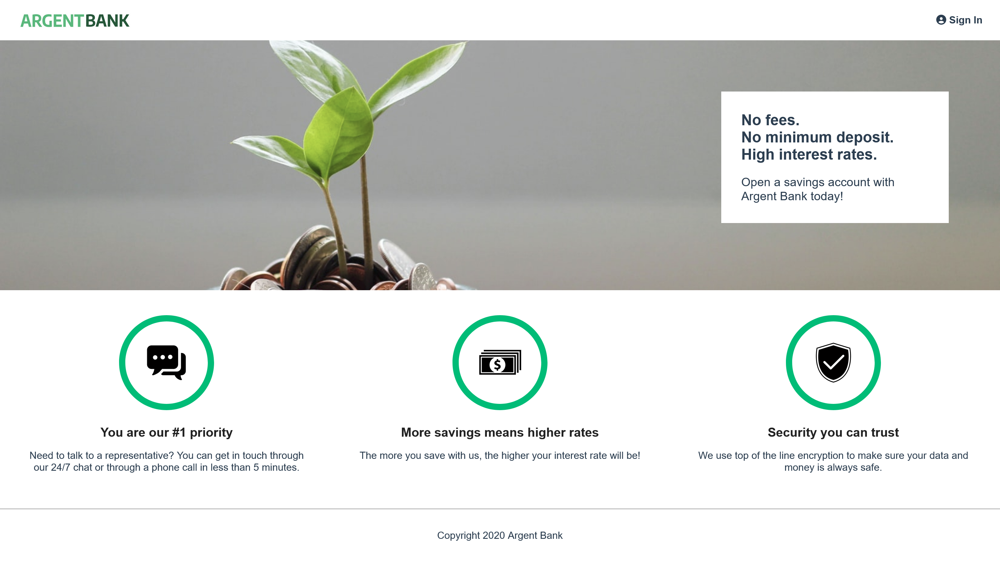
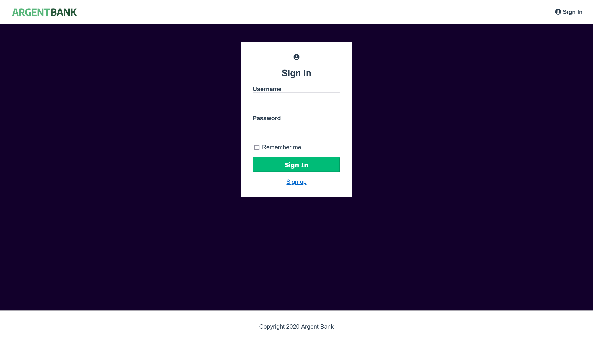
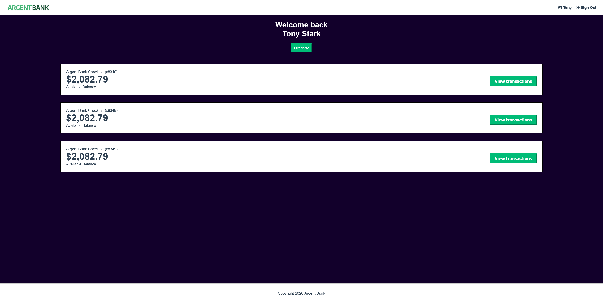

# Remede Agency

  
  
  
  

Remede Agency, specialised in web application development, entrusted us with a project for Argent Bank. Argent Bank wanted to develop a web application to access to their services. The application should allow users to log in and manage their bank accounts and profiles. In this project, we were involved in the code base for the authentication part. For the transactional part, all we had to do was define relevant endpoints for their API. For this, we were gived a Swagger documentation. This project was also an opportunity to discover global state management through the storage of user identifiers.

  

  

  

  

